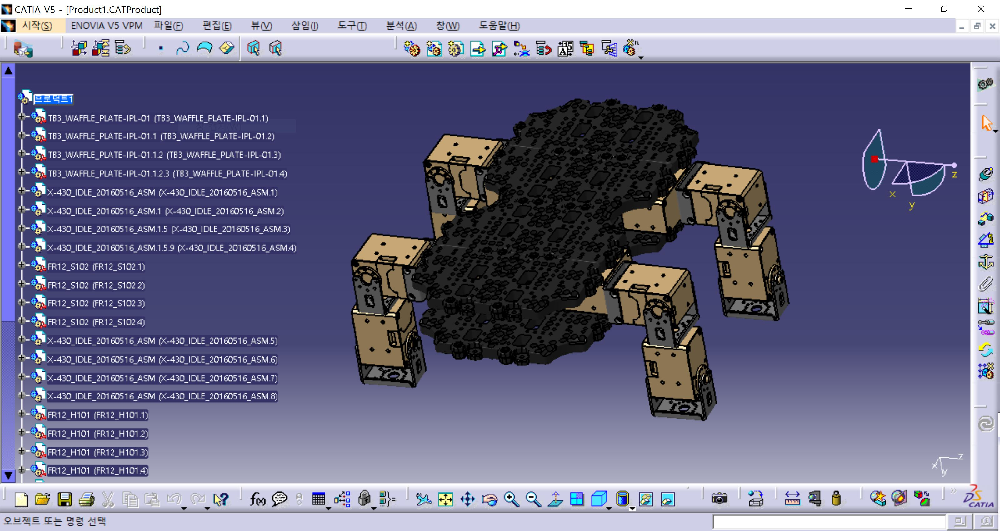
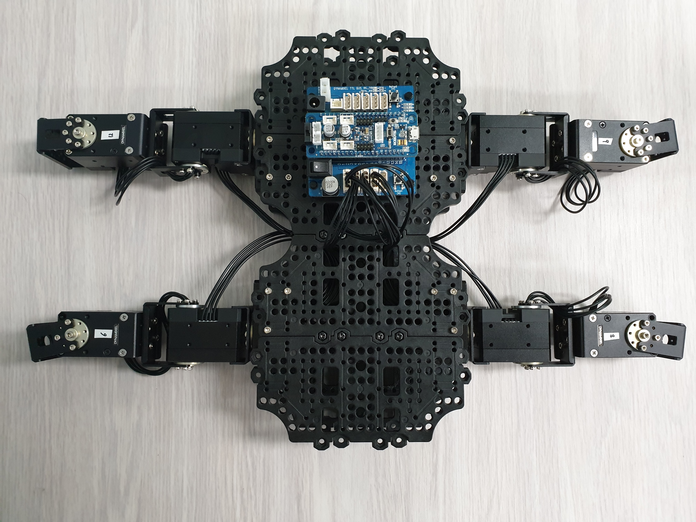

# Deep-Reiforcement-Learning-to-robot-s-gait

### Walkybot Project : For ROS_based robot platform in real-world

All of components are ROBOTIS's products

---

| PURPOSE | Used Product |
|---|:---:|
| `robot's joint` | DYNAMIXEL XM430-W350-R *12 |
| `motor's controller` | OpenCM9.04 + Expansion board |
| `PC 2 Robot` | U2D2 |
| `robot body frame` | TB3 plate *8 |
| `robot motor connection fram` | FR12-S102K set *8, FR12-H101K set *8 |
